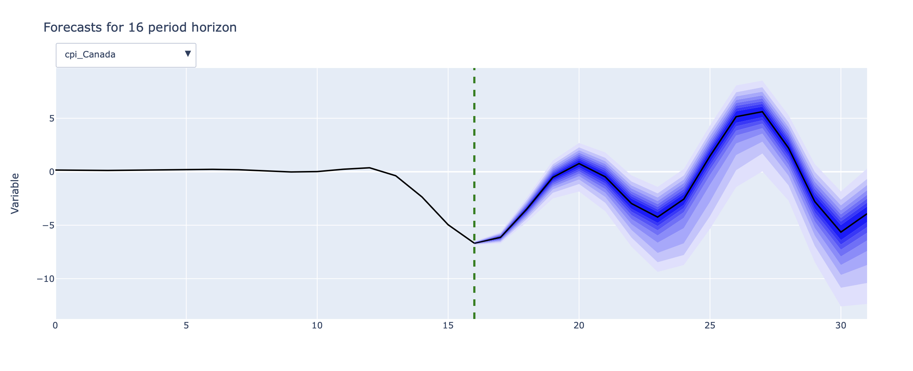

# Nowcasting Canada — Macro BVAR

## Introduction
This project (developed in response and at the start of the COVID‑19 pandemic) demonstrates Bayesian vector autoregression (BVAR) applied to Canadian macroeconomic indicators to evaluate how alternative shock scenarios (for example, housing-price) affect short-term forecasts of macro variables. The implementation is Colab and integrates R's `BVAR` package with Python via `rpy2`, producing interactive Plotly visualizations embedded in the notebook.

## Very short summary of the data
- The notebook uses ~monthly macro series (CPI, HPI, Housing Starts, Nominal household income, unemployment, and a large set of FRED‑MD variables). Series are transformed for stationarity (log diffs, differences) and merged.
- All the variables are studies using correlation matrix, correlation cluster dendoggram and other visual means.

## Models used and implemented
- Core model: Bayesian Vector Autoregression (BVAR) estimated with the R package `BVAR`.
- Priors tested and demonstrated in the notebook:
	- Minnesota / Litterman prior (bv_minnesota) — standard shrinkage toward random-walk behavior.
	- Sum‑of‑coefficients (SOC) prior (bv_soc) — (Doan et al. (1984)).
	- Single‑unit‑root (SUR) prior (bv_sur / bv_dummy) — (Sims (1993), SIms and Zha (1998))
- Estimation details: hierarchical prior selection via `bv_priors`, Metropolis‑Hastings (bv_metropolis / bv_mh) tuning for hyperparameters.

## Model convergence results
- The notebook includes standard Markov chain Monte Carlo (MCMC) diagnostics: trace plots and density plots for hyperparameters and selected coefficients, Geweke within-chain diagnostics, and Gelman–Rubin (potential scale reduction) across parallel chains (via `as.mcmc()` and `gelman.diag()`).
- Trace and Density plots:

- Model Residuals:

- Example settings used in the notebook (illustrative): n_draw=15000, n_burn=5000, n_thin=1; Metropolis tuning with `scale_hess` and `adjust_acc` to target acceptance rates (0.25–0.45). Parallel runs are collected as a list of `bvar` objects and converted to Python for plotting.
- Practical note: the notebook demonstrates visually acceptable convergence for the example runs:

## Conclusion (resume-ready summary)
- Demonstrates application of Bayesian time-series modeling (BVAR) to macro nowcasting and scenario analysis.

- Model short-term forecasts:

- Results of Model Impulse Response Function:

