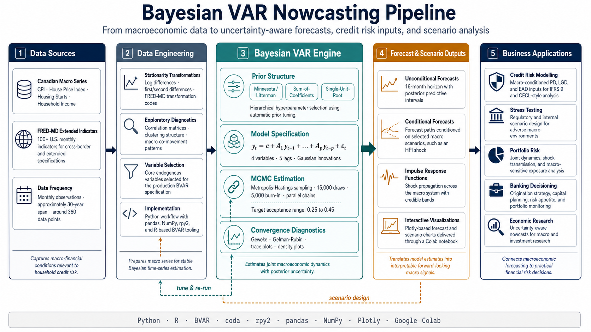
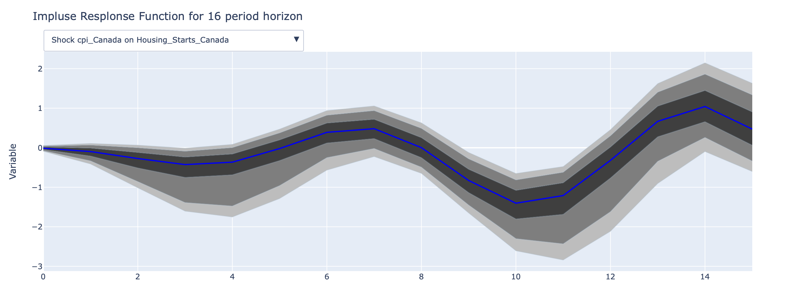
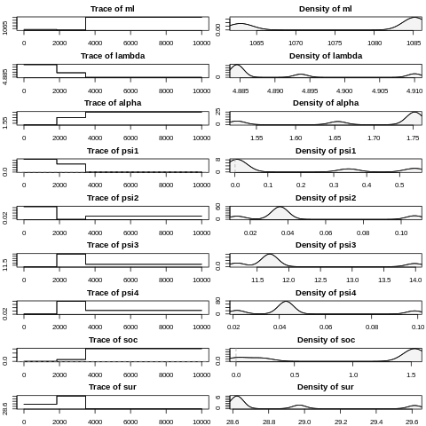
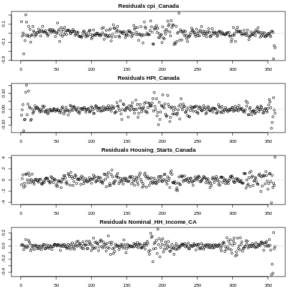
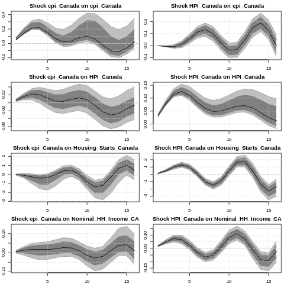

# Bayesian VAR Nowcasting of Canadian Macroeconomic Indicators

**Hierarchical Bayesian time-series modelling for short-horizon forecasts and conditional scenario analysis of Canadian CPI, House Price Index, Housing Starts, and Household Income, built during the COVID-19 pandemic to support credit risk, stress testing, and macro scenario workflows.**



## Executive Summary

This project implements a **Bayesian Vector Autoregression (BVAR)** to nowcast and forecast a set of core Canadian macroeconomic series under both unconditional and shock-driven scenarios. The model was developed during the early phase of the COVID-19 pandemic, when classical frequentist VARs were unstable and informed priors were essential for producing usable forecasts.

The deliverable is a reproducible, Colab-ready notebook that:

- Estimates a 4-variable BVAR on monthly Canadian macro data using the R `BVAR` package, called from Python through `rpy2`.
- Tests three prior families (Minnesota/Litterman, sum-of-coefficients, single-unit-root) with hierarchical hyperparameter selection via Metropolis-Hastings.
- Generates **impulse response functions (IRFs)** and **conditional forecasts** along user-specified paths for variables such as the House Price Index.
- Validates convergence with Geweke and Gelman-Rubin diagnostics across parallel MCMC chains.
- Produces interactive Plotly visualizations with confidence bands for direct review by risk and economics stakeholders.




## Business Context and Use Cases

Forecasts of inflation, housing prices, household income, and housing activity are direct inputs into a wide range of bank, insurer, and asset-manager models. This project was framed to feed exactly those workflows:

- **Credit risk modelling:** macroeconomic conditioning variables for **PD**, **LGD**, and **EAD** models under IFRS 9 / CECL forward-looking provisioning.
- **Stress testing and scenario analysis:** generation of conditional paths (e.g. a sustained CPI shock or a house-price correction) for use in regulatory and internal stress tests.
- **Portfolio and asset-allocation research:** quantification of joint dynamics and shock propagation across price, housing, and income variables.
- **Banking and credit decision-making:** consistent macro forecasts underpinning origination strategy, capital planning, and risk appetite.
- **Investment and economic research:** uncertainty-aware nowcasts with explicit confidence bands rather than point forecasts.

## Why Bayesian VAR

Classical VARs over-fit when the system is rich and data are short, a problem amplified by the COVID-19 break in macro time series. A Bayesian approach addresses this directly:

- **Priors regularize estimation** when the parameter space is large relative to sample size.
- **Posterior distributions** provide native uncertainty quantification, so every forecast comes with credible bands rather than a single number.
- **Conditional forecasting** supports clean "what-if" analysis along a chosen variable's path, which maps directly to stress-test narratives.

## Data

| Series | Symbol | Frequency | Role |
|---|---|---|---|
| Canada CPI (All-items) | `cpi_Canada` | Monthly | Inflation |
| Canada House Price Index | `HPI_Canada` | Monthly | Housing prices |
| Canada Housing Starts | `Housing_Starts_Canada` | Monthly | Housing activity |
| Canada Nominal Household Income | `Nominal_HH_Income_CA` | Monthly | Income / demand |

The estimated model uses **4 endogenous variables, 360 monthly observations, and 5 lags**. The notebook also documents an extended variable set (non-residential permits, nominal wages, real GDP, median family income, unemployment rate, household counts) and integrates the **FRED-MD** macro database via the `BVAR::fred_transform` helper for cross-border or extended specifications.

Series are transformed for stationarity using log-differences and first/second differences as appropriate, with transformations driven by FRED-MD-style transformation codes. Variable groupings are explored using correlation matrices and hierarchical clustering dendrograms to inform factor selection.

## Methodology

### Model

A Bayesian VAR of the form

$$y_t = c + A_1 y_{t-1} + \dots + A_p y_{t-p} + \varepsilon_t, \quad \varepsilon_t \sim \mathcal{N}(0, \Sigma)$$

estimated with hierarchical priors and posterior simulation via Metropolis-Hastings.

### Priors

- **Minnesota / Litterman prior** (`bv_minnesota`): shrinks dynamics toward independent random walks, with separate tightness parameters for own-lag (lambda), cross-lag (alpha), and residual-variance (psi) components.
- **Sum-of-coefficients prior** (`bv_soc`): pushes the sum of own-lag coefficients toward 1 and cross-lag sums toward 0, supporting unit-root-like behaviour (Doan, Litterman, Sims, 1984).
- **Single-unit-root prior** (`bv_sur`): adds a dummy observation consistent with cointegration of levels (Sims; Sims and Zha).

Hyperparameters are treated hierarchically through `bv_priors(hyper = "auto")` and sampled via `bv_metropolis` with adaptive `scale_hess` tuning targeting an acceptance rate in the **0.25 to 0.45** range.

### Estimation

Representative configuration used in the notebook:

```r
priors_app <- bv_priors(hyper = "auto", mn = mn, soc = soc, sur = sur)
mh         <- bv_metropolis(scale_hess = 1, adjust_acc = TRUE,
                            acc_lower = 0.25, acc_upper = 0.45,
                            acc_change = 0.01)
run_ca     <- bvar(x_ca_normal, lags = 5,
                   n_draw = 15000, n_burn = 5000, n_thin = 1,
                   priors = priors_app, mh = mh)
```

Multiple chains are run in parallel with `par_bvar` for between-chain diagnostics.

### Forecasting and Scenario Analysis

- **Unconditional forecasts:** posterior predictive distributions over a 16-month horizon with multiple confidence bands.
- **Conditional forecasts:** posterior paths conditional on a user-specified trajectory for a chosen variable (e.g. `cond_var = "HPI_Canada"`), using the model's `predict` method with `cond_path`. This is the primary mechanism used for scenario stress testing.
- **Impulse Response Functions:** `bv_irf(horizon = 16, identification = TRUE)` with confidence bands at multiple credible levels.

## Convergence and Diagnostics

The notebook applies the standard MCMC diagnostic toolkit via R's `coda` package:

- **Trace and density plots** for hyperparameters and selected coefficients.
- **Geweke (1992)** within-chain convergence test (`geweke.diag`).
- **Gelman-Rubin (1992)** between-chain potential scale reduction factor across parallel chains (`gelman.diag`).

Trace and density plots:



Residual diagnostics across the four endogenous variables:



Impulse response functions with credible bands:



The example runs in the notebook show visually acceptable convergence; diagnostics should be re-evaluated whenever data, priors, or sampler settings change.


## Tech Stack

- **Languages:** Python 3, R
- **Core libraries:** R `BVAR`, R `coda`, R `parallel`, `rpy2`
- **Data and analysis:** `pandas`, `numpy`, `scipy`, `seaborn`
- **Visualization:** `plotly` (interactive forecast and IRF plots), `matplotlib`
- **Environment:** Google Colab (Jupyter), with Google Drive integration for input data


## Key Outputs

- Multi-horizon **conditional forecasts** for CPI, House Price Index, Housing Starts, and Household Income with explicit credible bands.
- **Impulse response functions** quantifying how shocks propagate across the four-variable system.
- **MCMC convergence diagnostics** demonstrating the validity of the posterior approximation.
- A reproducible, end-to-end **Bayesian forecasting pipeline** suitable for adaptation to other macro nowcasting and stress-testing problems.


## References

- Doan, T., Litterman, R., Sims, C., 1984. Forecasting and conditional projection using realistic prior distributions. *Econometric Reviews*, 3(1), 1-100.
- Giannone, D., Lenza, M., Primiceri, G.E., 2015. Prior selection for vector autoregressions. *Review of Economics and Statistics*, 97(2), 436-451.
- Kilian, L., Lütkepohl, H., 2017. *Structural Vector Autoregressive Analysis*. Cambridge University Press.
- Kuschnig, N., Vashold, L., 2019. BVAR: Bayesian Vector Autoregressions with Hierarchical Prior Selection in R.
- Geweke, J., 1992. Evaluating the accuracy of sampling-based approaches to the calculation of posterior moments.
- Gelman, A., Rubin, D.B., 1992. Inference from iterative simulation using multiple sequences.


